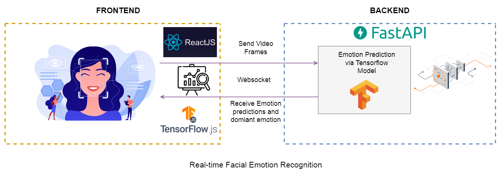
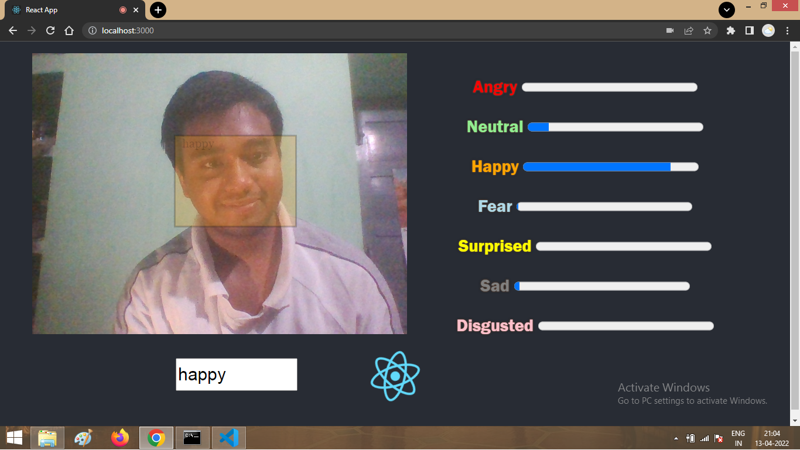

# Realtime Facial Emotion Recognition
<br>

# Introduction
This repository demonstrates an end-to-end pipeline for real-time Facial emotion recognition through full-stack development.
The frontend is developed in react.js and the backend is developed in python. The emotion prediction model is built with Tensorflow Keras, and for real-time face detection with animation on the frontend, Tensorflow.js have been used.
# Demo video
Below is a demo video of the application that I have built.


High quality youtube video available at - https://youtu.be/aTe05n6T5Vo

[](https://youtu.be/vt5fpE0bzSY)

# Technologies used
1. ReactJS.<br>
    - Building the front-end UI.
    - Displaying Facial emotion in real-time.
    - establish and connect to WebSocket to send video frames and receive Emotion prediction probabilities with dominant emotion.
2. FastAPI.<br>
    - Connect to webSocket, receive video frame, send model predictions to front-end server.
    - Build API.
3. Tensorflow Keras.<br>
   - A pre-built emotion prediction Keras model is deployed.
   - The model classifies 7 different emotions emotion: happy, sad, neutral, disgusted, surprised, fear, and angry.
   - Model returns the prediction probability of each emotion.
4. Tensorflow JS.<br>
   - Face Detection model
   - Detect faces in an image using a Single Shot Detector architecture with a custom encoder(Blazeface).

# Implementation
Implementation of the full-stack end-to-end face emotion recognition pipeline.

## setup
```sh
$ cd server
$ pip install -r requirements.txt
```
## Starting the API server 
```sh
$ cd server
$ uvicorn main:app --reload
```

## Starting the React deployment server
```sh
$ cd emotion-recognition
$ npm start
```

# UI features

The UI is developed in ReactJS, the following features have been added to demonstrate real-time facial emotion recognition.
- Progress bars for each emotion( happy, sad, neutral, disgusted, surprised, fear, angry) that demonstrate the change of emotion from facial expression in real-time via web camera.
- Detecting face on webcam canvas and changing colour within Bounding box with respect to the predicted emotion also displaying the dominant emotion.

# Architecture
The process of streaming video in real-time was possible with WebSocket. In the pipeline, we send video frames from react server to the API server and receive the model's emotion prediction from the API server. The Keras model predicts the probability of each emotion for each frame.

While sending a response from the API server the response payload consists of two keys "_predictions_" and "_emotion_". The "_prediction_" key consists of prediction probabilities of each emotion predicted by the model, which is used for dynamic emotion change with each frame. The "_emotion_" key has the dominant emotion, which is used for dynamic change in bounding box colour w.r.t the dominant emotion and displaying the dominant emotion inside the bounding box for each frame.
The bounding box around the face is detected using a TensorflowJS model.
# Conclusion
1. The pipeline successfully streams video in real-time and updates the emotion recognition dashboard from the user's face for each frame.
2. Pre-built Ml model predicts emotion for each frame. A more efficient light model with higher accuracy could be custom built and loaded for improving the performance of the ml pipeline.
3. The Frontend and backend pipelines are connected via Websockets which enhances the real-time video streaming process.
4. TensorflowJS used for face detection on the front-end gives scope to a more interactive interface.

# Scopes of Improvement
1. Custom light and efficient ML model with higher accuracy could provide us with better results.
2. There is a lag between the instant frame and ml model prediction, this issue could be solved by running it over a system with better computing power. My project ran on a system with 4GM RAM.
